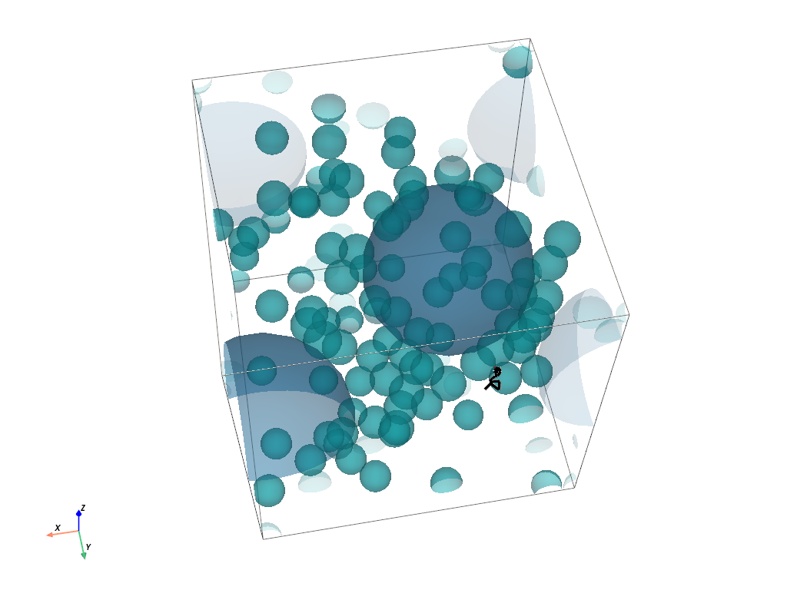

# epentry

epentry is a small Python package for simulating the rate at which radicals enter particles in a box. It provides tools to build particle ensembles, run random-walk entry simulations, and analyze the resulting trajectories and entry statistics.

For a worked example and visual walkthrough, see the notebook in [notebooks/entry.ipynb](notebooks/entry.ipynb).

